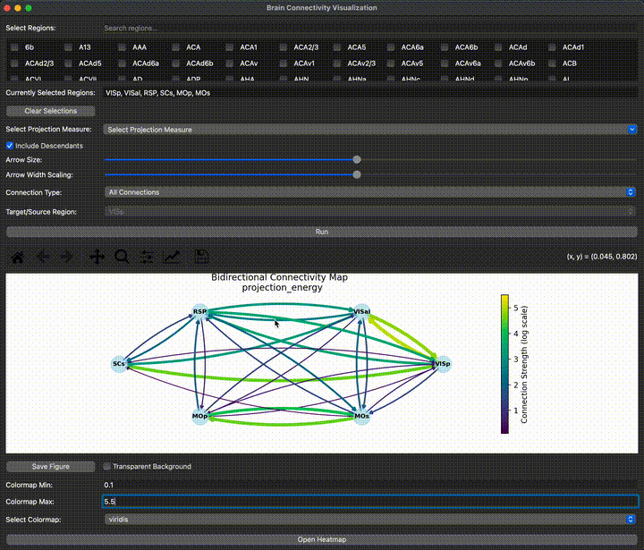

# Allen Brain Atlas Connectivity Map
<p align="center">
  
</p>

# Allen Brain Atlas Connectivity Data storage

Allows you to generate connectivity maps of different brain regions of interest.

**Note**: The accuracy of these visualizations depends on the quality of the experimental data, which may be subject to certain limitations. For example, injections intended for specific brain regions may inadvertently spread to adjacent areas, leading to unintended labeling and potential overestimation of projection signals. These injection errors can affect the specificity of the observed connectivity patterns, potentially introducing noise or artifacts in the visualized results. Users should interpret the connectivity strengths with caution, keeping in mind that the anatomical precision of injections may vary across experiments.

### Features:

- Plots the bidirectional connectivity map of each region with each other (n!) and colorcodes it by connection strength.
- Can also only plot Afferent connections or Efferent connections and you can select the target.
- Images can be saved as png or svg with or without transparent background
- Different colormap can be selected, with both their min and max, in case of different plotting we want the same scale.
- Arrow size is also scaled by connection strength and can be adjusted live.
- Saves metadata in filename
- *NEW*: Heatmap of connectivity strength between regions, colormap and saving options available.

Data is stored in the `connectivity` folder, locally.
This repository contains the code to download the Allen Brain Atlas Connectivity Data. The data is downloaded from the Allen Brain Atlas API. The data is stored on your machine in the folder path specified in `data_processing.py` \\
At line: `mcc = MouseConnectivityCache(manifest_file='connectivity/mouse_connectivity_manifest.json')`.

## Installation
- Create a conda environment and activate it. 
```bash
conda create --name <env> python=3.7
conda activate <env>
```

- To install the required packages, run the following command:
```bash
pip install -r requirements.txt
```

## Usage
- To run the following command:
```bash
python main.py
```
- The first time you run any new brain region, it will take some time to download the data from the allen brain atals.

## App overview

### Main Window

<p align="center">
  
</p>

### Heatmap window (*NEW*)

<p align="center">
  
</p>
