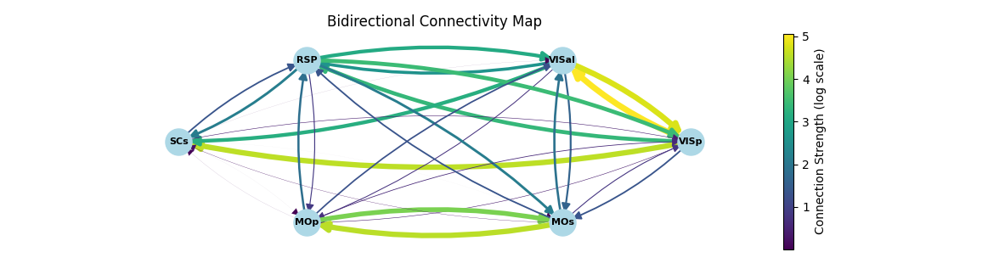
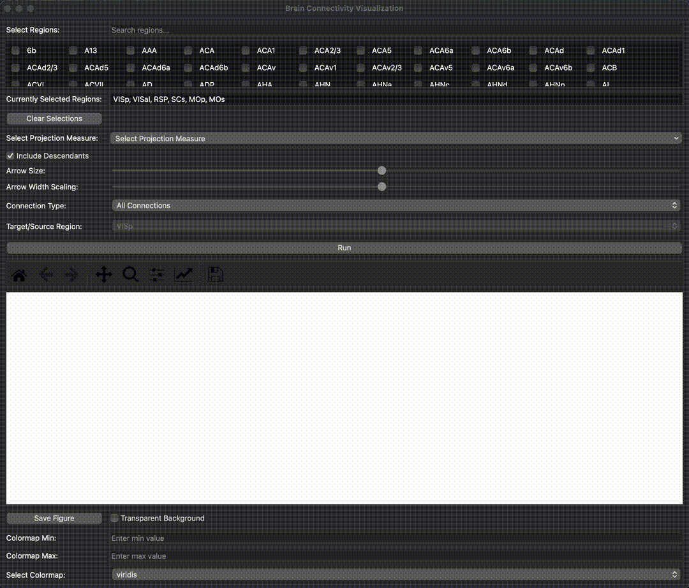

# Allen Brain Atlas Connectivity Map
<p align="center">
  
</p>

# Allen Brain Atlas Connectivity Data storage
Data is stored in the `connectivity` folder, locally.
This repository contains the code to download the Allen Brain Atlas Connectivity Data. The data is downloaded from the Allen Brain Atlas API. The data is stored on your machine in the folder path specified in `data_processing.py` \\
At line: `mcc = MouseConnectivityCache(manifest_file='connectivity/mouse_connectivity_manifest.json')`. The data is stored in the `connectivity` folder. 

## Installation
- Create a conda environment and activate it. 
```bash
conda create --name <env> python=3.7
conda activate <env>
```

- To install the required packages, run the following command:
```bash
pip install -r requirements.txt
```

## Usage
- To download the data, run the following command:
```bash
python main.py
```

## App overview
<p align="center">
  
</p>
